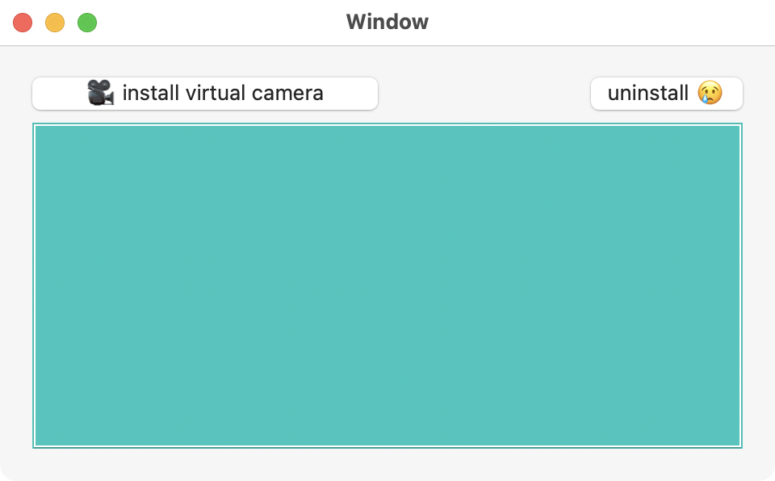

Camera Extension template
------
for macos.

This is an implementation of camera extension app (as shown in [this WWDC video](https://developer.apple.com/videos/play/wwdc2022/10022/)).  It will add a new device to the OS and will appear when `enumerateDevices` is called.

More info on developing camera extensions can be found [here](https://developer.apple.com/documentation/coremediaio/creating_a_camera_extension_with_core_media_i_o).

## requirements
to build the extension in xcode, you need for realsies apple dev team credentials ie "Pluot Communications, Inc"

## installation
under construction
1. open `vipyne.xcodeproj` in xcode
2. build app

3. copy app from build directory to `/Applications`

```
 $ cp $HOME/Library/Developer/Xcode/DerivedData/vipyne-godbtgrvjcisptdglqohfnzaajfa/Build/Products/Debug/vipyne.app /Applications
 ```
4. open vipyne.app from /Applications and click install virtual camera

6. follow prompts to allow installation


## usage (basic)
After install, the camera will be in devices list, even after the installation app is closed. That's it!
```
$ ffmpeg -f avfoundation -list_devices true -i "" 
...
[AVFoundation indev @ 0x7fb15bf05700] AVFoundation video devices:
[AVFoundation indev @ 0x7fb15bf05700] [0] mmhmm Camera
[AVFoundation indev @ 0x7fb15bf05700] [1] FaceTime HD Camera (Built-in)
[AVFoundation indev @ 0x7fb15bf05700] [2] viRTUALpyne cam 2 (vipyne) <========================
[AVFoundation indev @ 0x7fb15bf05700] [3] CMIOMinimalSample Device
[AVFoundation indev @ 0x7fb15bf05700] [4] Reincubate Camo
[AVFoundation indev @ 0x7fb15bf05700] [5] Capture screen 0
```


## usage (recommended)

- [update the camera name](https://github.com/vipyne/macos-camera-extension/blob/main/browserConsoleSnippet.js#L42)
- use [the javascript snippet](https://github.com/vipyne/macos-camera-extension/blob/main/browserConsoleSnippet.js) in your browser console.
- optional: pass in different fake media like so:
`await initGUM('my camera name (vipyne)', 'https://bestfakemedia.biz/faux.mp4')`


## development

If you want to generate your own fake media within the app [camProvider.swift](https://github.com/vipyne/macos-camera-extension/blob/main/cam/camProvider.swift#L93-L160) is where you can change the [camera name](https://github.com/vipyne/macos-camera-extension/blob/main/cam/camProvider.swift#L15) and do more interesting camera things... Go wild. Godspeed.
