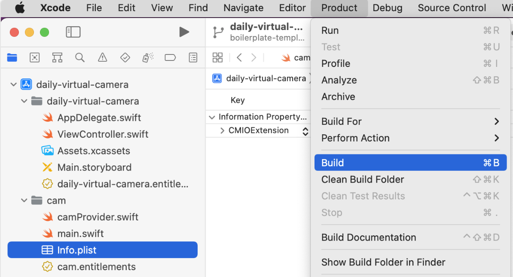
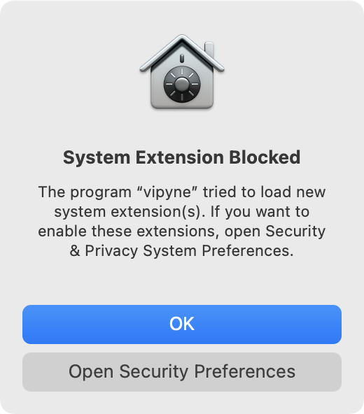
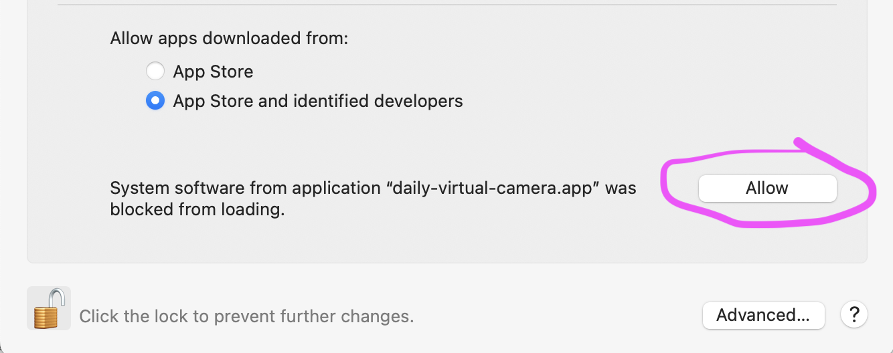

Camera Extension template
------

This is an implementation of camera extension app (as shown in [this WWDC video](https://developer.apple.com/videos/play/wwdc2022/10022/)).  It will add a new device to the OS and will appear when `enumerateDevices` is called.

More info on developing camera extensions can be found [here](https://developer.apple.com/documentation/coremediaio/creating_a_camera_extension_with_core_media_i_o).

## requirements
To build the extension in xcode, you need for realsies apple dev team credentials ie "Pluot Communications, Inc"

## installation
1. open `daily-virtual-camera.xcodeproj` in xcode
2. build app

3. copy app from build directory to `/Applications`


```
 $ cp $HOME/Library/Developer/Xcode/DerivedData/daily-virtual-camera-.../Build/Products/Debug/daily-virtual-camera.app /Applications
```
4. open daily-virtual-camera.app from /Applications and click install virtual camera
6. follow prompts to allow installation




## usage (basic)
After install, the camera will be in devices list, even after the installation app is closed. That's it!
```
$ systemextensionsctl list
1 extension(s)
--- com.apple.system_extension.cmio
enabled active  teamID  bundleID (version)  name  [state]
* * EEBGKV9N3N  co.daily.daily-virtual-camera.cam (1.0/1)  cam [activated enabled]
```

```
$ ffmpeg -f avfoundation -list_devices true -i "" 
...
[AVFoundation indev @ 0x7fb15bf05700] AVFoundation video devices:
[AVFoundation indev @ 0x7fb15bf05700] [0] FaceTime HD Camera (Built-in)
[AVFoundation indev @ 0x7fb15bf05700] [1] Daily Camera (daily.co) <========================
[AVFoundation indev @ 0x7fb15bf05700] [2] Capture screen 0
```


## usage (recommended)

* [update the camera name](https://github.com/daily-virtual-camera/macos-camera-extension/blob/main/browserConsoleSnippet.js#L42) if changed
* use [the javascript snippet](https://github.com/daily-virtual-camera/macos-camera-extension/blob/main/browserConsoleSnippet.js) in your browser console.
* optional: pass in different fake media
* `await initGUM('my camera name (daily-virtual-camera)', 'https://bestfakemedia.biz/faux.mp4')`


## uninstallation
open the app and click uninstall and go through the permissions rigamarole. 
note: device will not be fully uninstalled until the computer is rebooted.

```
$ systemextensionsctl list
1 extension(s)
--- com.apple.system_extension.cmio
enabled active  teamID  bundleID (version)  name  [state]
    EEBGKV9N3N  co.daily.daily-virtual-camera.cam (1.0/1)  cam [terminated waiting to uninstall on reboot]
```


## development

If you want to generate your own fake media within the app [camProvider.swift](https://github.com/daily-virtual-camera/macos-camera-extension/blob/main/cam/camProvider.swift#L93-L160) is where you can change the [camera name](https://github.com/daily-virtual-camera/macos-camera-extension/blob/main/cam/camProvider.swift#L15) and do more interesting camera things... Go wild. Godspeed.
